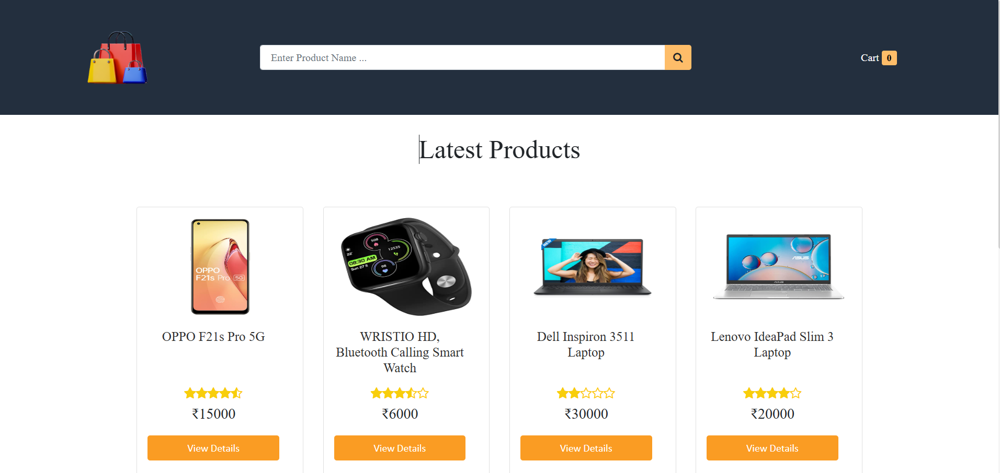

# Ecom- Website

E-commerce web application that allows users to search for products, add items to a shopping cart, and browse a dynamic product catalog

# Setup
cd frontend

npm install

cd backend 

npm install

Update MongoDb DB_URl in config.env

Import the product.json to your Mongo_DB collection.

npm start

